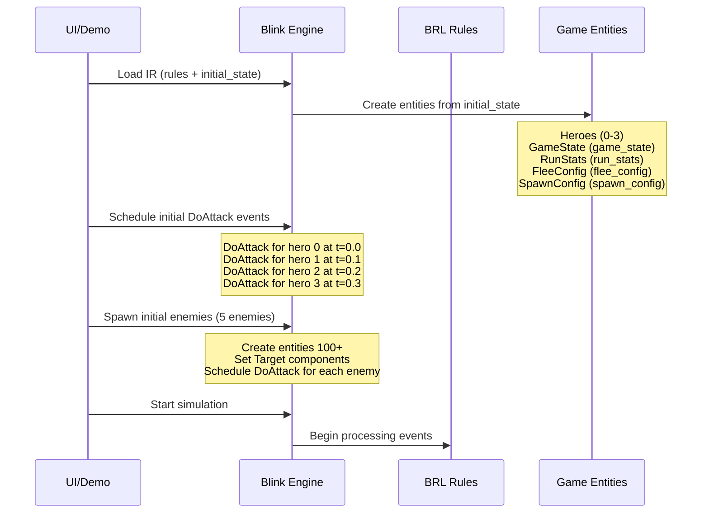
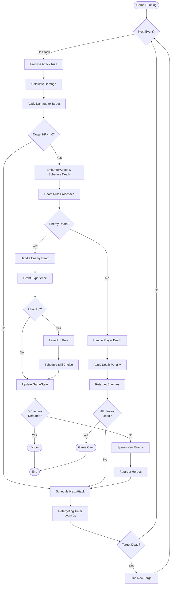
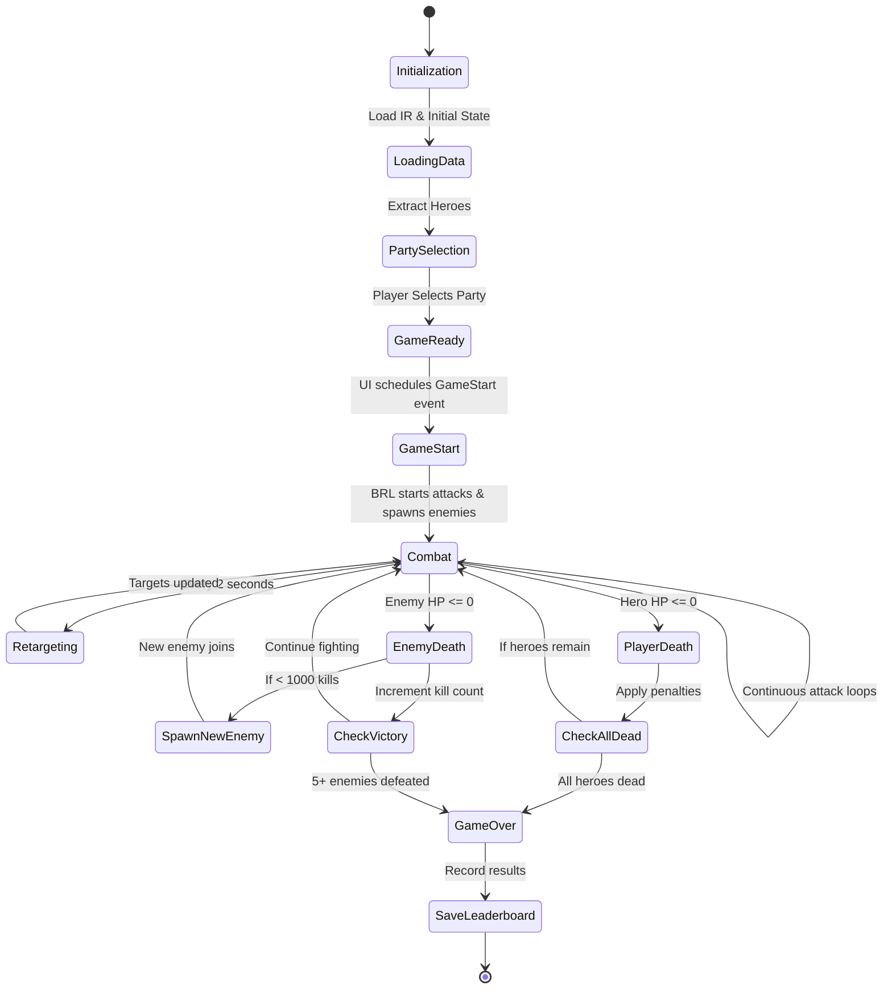

# Game Flow Analysis: Classic RPG

## Problem Statement
Heroes load but the game is not running. This document analyzes the current BRL implementation to understand how the game starts, runs, and completes.

## Game Flow Overview

### 1. Game Initialization (How the Game Should Start)



### 2. Combat Loop (How the Game Runs)



### 3. Key Game Systems

#### Attack System
The attack system is the core combat loop:

```
rule attack_rule on DoAttack {
    if entity.Target.entity != null && entity.Health.current > 0 {
        let target = entity.Target.entity
        let damage = entity.Combat.damage + entity.Buffs.damageBonus
        
        // Apply damage to target
        target.Health.current -= damage
        
        // Emit after attack event
        schedule AfterAttack {
            attacker: entity.id
            target: target.id
        }
        
        // Schedule next attack
        let delay = 1 / (entity.Combat.attackSpeed + entity.Buffs.hasteBonus)
        schedule [delay: delay] DoAttack {
            source: entity.id
        }
    }
}
```

**Key Points:**
- Each DoAttack event causes damage and schedules the next attack
- This creates a continuous attack loop for each entity
- Attack stops if target is null or attacker is dead

#### Death and Retargeting System
When an entity dies:

```
rule death_check on AfterAttack {
    if entity.Health.current <= 0 {
        schedule Death {
            target: entity.id
        }
    }
}
```

Then two separate handlers:

```
rule enemy_death_handler on Death {
    if entity.Enemy.tier > 0 && entity.Health.current <= 0 {
        schedule EnemyDefeated {
            enemy: entity.id
            expReward: entity.Enemy.expReward
            isBoss: entity.Enemy.isBoss
        }
    }
}

rule player_death_handler on Death {
    if entity.Team.isPlayer && entity.Health.current <= 0 {
        schedule PlayerDefeated {
            player: entity.id
        }
    }
}
```

**Retargeting System:**
```
rule start_global_retargeting on EnemySpawned {
    // Only start retargeting once, when first enemy spawns
    if entity.GameState.currentWave == 1 && entity.GameState.retargetingActive == false {
        entity.GameState.retargetingActive = true
        // Schedule first retargeting check in 2 seconds
        schedule [delay: 2.0] CheckAllTargets {
        }
    }
}

rule check_entity_target on CheckAllTargets {
    // Rule fires for each entity with Target and Health components
    if entity.Health.current > 0 && entity.Target.entity != null {
        let target = entity.Target.entity
        if target.Health.current <= 0 {
            entity.Target.entity = null
            schedule FindNewTarget {
                seeker: entity.id
            }
        }
    }
}

rule reschedule_retargeting on CheckAllTargets {
    // Only fire for entity with GameState component
    if entity.GameState.retargetingActive && entity.GameState.gameOver == false {
        // Schedule next check in 2 seconds
        schedule [delay: 2.0] CheckAllTargets {
        }
    }
}
```

#### Victory/Defeat Conditions

```
rule victory_check on CheckVictory {
    if entity.GameState.enemiesDefeated >= 5 {
        entity.GameState.bossDefeated = true
        entity.GameState.victory = true
        entity.GameState.gameOver = true
        schedule GameOver {
            victory: true
        }
    }
}

rule game_over_check on PlayerDefeated {
    entity.GameState.gameOver = true
    schedule GameOver {
        victory: false
    }
}
```

### 4. Identified Issues

#### Issue #1: Missing Initial Enemy Spawn Event
**Problem:** The BRL rules expect an `EnemySpawned` event to trigger retargeting, but there's no rule to actually spawn enemies initially.

**Location:** `classic-rpg.brl` lines 293-303 and 407-416

**Impact:** 
- Initial enemies are spawned by the UI, not by BRL rules
- The retargeting system never activates because `EnemySpawned` is never triggered
- Entities may attack dead targets forever

**Proposed Fix:**
Add an initialization rule that spawns initial enemies:
```brl
rule initialize_game on GameStart {
    schedule SpawnEnemyWave {
    }
}

rule spawn_wave on SpawnEnemyWave {
    if entity.GameState.gameOver == false {
        schedule EnemySpawned {
            wave: entity.GameState.currentWave
        }
    }
}
```

#### Issue #2: No Automatic Attack Initialization
**Problem:** The UI must manually schedule DoAttack events for heroes. There's no BRL rule to start combat automatically.

**Location:** Demo code lines 3131-3137

**Impact:**
- Game won't start if UI forgets to schedule attacks
- Inconsistent initialization between different demos

**Proposed Fix:**
Add a rule to start hero attacks automatically:
```brl
rule start_hero_attacks on GameStart {
    if entity.Team.isPlayer && entity.Health.current > 0 {
        // Stagger attacks by 0.1s per hero to avoid synchronization
        let delay = entity.id * 0.1
        schedule [delay: delay] DoAttack {
            source: entity.id
        }
    }
}
```

#### Issue #3: Missing GameStart Event
**Problem:** There's no `GameStart` event defined in the BRL to trigger initialization rules.

**Impact:**
- No way to start the game from BRL rules alone
- UI must handle all initialization

**Proposed Fix:**
UI should schedule a `GameStart` event after loading entities:
```javascript
// After creating entities from IR
game.scheduleEvent('GameStart', 0, {});
game.start();
```

#### Issue #4: Enemy Spawning Logic Not in BRL
**Problem:** Enemy spawning is handled entirely in UI code (lines 2920-2987). This means:
- Enemy stats calculation is in UI, not in game rules
- Spawn logic can't be modified without changing UI
- Different UIs might spawn enemies differently

**Location:** Demo code `spawnEnemy()` function

**Proposed Fix:**
Move enemy spawning logic to BRL rules:
```brl
component EnemySpawnState {
    nextEnemyId: integer
    enemyTemplates: list<id>
}

rule handle_enemy_defeated on EnemyDefeated {
    if entity.GameState.enemiesDefeated < 1000 {
        schedule SpawnNewEnemy {
        }
    }
}

rule spawn_new_enemy on SpawnNewEnemy {
    // Select template based on kills
    let kills = entity.GameState.enemiesDefeated
    let tier = min(6, floor(kills / 50) + 1)
    
    // Create enemy entity with scaled stats
    // (This would require BRL entity creation syntax)
}
```

#### Issue #5: Target Assignment Not Automated
**Problem:** When enemies spawn, the UI manually assigns random targets. This should be handled by BRL rules.

**Location:** Demo code lines 2996-3001

**Proposed Fix:**
Add a rule to automatically assign targets when entities spawn:
```brl
rule assign_initial_target on EntityCreated {
    if entity.Team.isPlayer == false && entity.Target.entity == null {
        // Find a random alive player
        schedule FindNewTarget {
            seeker: entity.id
        }
    }
}

rule find_target on FindNewTarget {
    // Find all alive enemies/players of opposite team
    // Select one at random
    // Set Target.entity
}
```

### 5. Sequencing Issues

#### Current Flow (Problematic)
```
UI: Load IR
UI: Create heroes from selected party
UI: Schedule DoAttack for each hero
UI: Spawn 5 enemies
UI: Assign random targets to heroes and enemies
UI: Start simulation
```

**Problems:**
1. If UI forgets to schedule DoAttack, nothing happens
2. If UI forgets to spawn enemies, nothing happens  
3. No EnemySpawned event, so retargeting never starts
4. Game logic split between UI and BRL

#### Proposed Flow (Improved)
```
UI: Load IR
UI: Create heroes from selected party
UI: Schedule GameStart event
UI: Start simulation

BRL: On GameStart
  - Start hero attacks (staggered)
  - Spawn initial enemy wave
  - Emit EnemySpawned event
  - Start retargeting system
```

**Benefits:**
1. Single point of initialization (GameStart event)
2. All game logic in BRL
3. UI only needs to create heroes and start simulation
4. Consistent across all demos

### 6. Complete Game Lifecycle



## Recommendations

### High Priority Fixes

1. **Add GameStart Event**
   - Define GameStart event in BRL
   - Add rules to initialize combat on GameStart
   - Update UI to schedule GameStart instead of manual initialization

2. **Fix Retargeting Activation**
   - Ensure EnemySpawned is emitted during initialization
   - Or change retargeting to start on GameStart instead

3. **Automate Initial Attacks**
   - Add rule to schedule DoAttack for all alive heroes on GameStart
   - Remove manual scheduling from UI

### Medium Priority Improvements

4. **Move Enemy Spawning to BRL**
   - Define enemy templates in BDL
   - Implement spawning rules in BRL
   - UI only needs to trigger initial spawn

5. **Automate Target Assignment**
   - Add FindNewTarget rule implementation
   - Automatically assign targets when entities join combat

### Low Priority Enhancements

6. **Add Combat Phases**
   - Pre-combat phase for buffs/preparation
   - Combat phase for fighting
   - Post-combat phase for loot/experience

7. **Improve Victory Conditions**
   - Current: 5 kills (very quick)
   - Proposed: Progressive waves with boss encounters

## Implementation Priority

**Phase 1: Minimum Viable Fixes (Make it work)**
- Add GameStart event handling to UI
- Ensure EnemySpawned is emitted (even if from UI initially)  
- Fix retargeting activation

**Phase 2: Clean Architecture (Make it right)**
- Move attack initialization to BRL
- Move target assignment to BRL
- Centralize game flow in BRL

**Phase 3: Feature Complete (Make it great)**
- Move enemy spawning to BRL
- Implement proper wave system
- Add more sophisticated AI/targeting rules

## Testing Checklist

- [ ] Heroes load from selection
- [ ] Combat starts automatically
- [ ] Attacks occur continuously
- [ ] Enemies spawn and join combat
- [ ] Retargeting system activates
- [ ] Dead targets are replaced with new ones
- [ ] Heroes level up and gain experience
- [ ] Player deaths apply penalties
- [ ] Victory condition triggers at 5 kills
- [ ] Defeat condition triggers when all heroes die
- [ ] Leaderboard saves completed runs

## Conclusion

The current implementation works but has the game logic split between UI and BRL. The main issue is that several critical initialization steps are in the UI code rather than in BRL rules:

1. Attack initialization
2. Enemy spawning
3. Target assignment
4. Retargeting activation

This makes the game fragile and dependent on the UI doing everything correctly. The recommended fixes move these responsibilities into BRL rules triggered by a single `GameStart` event, making the system more robust and consistent.
