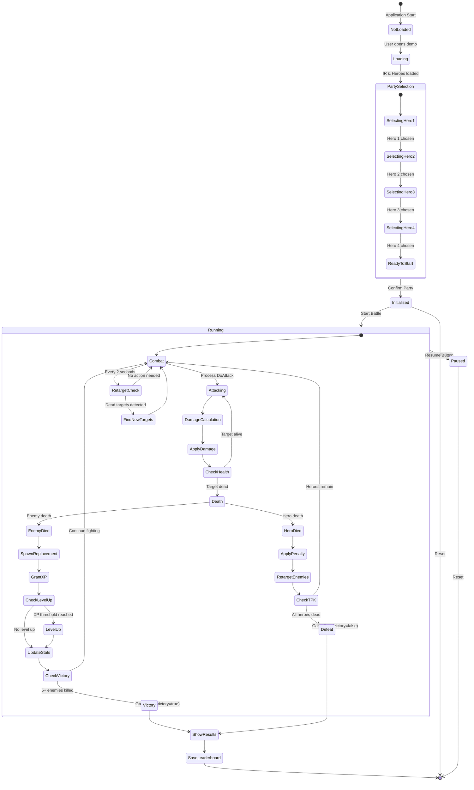
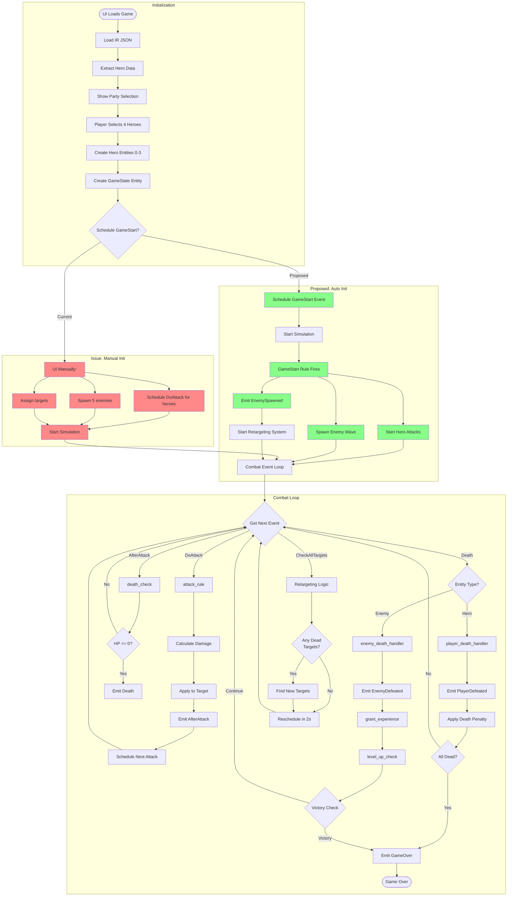
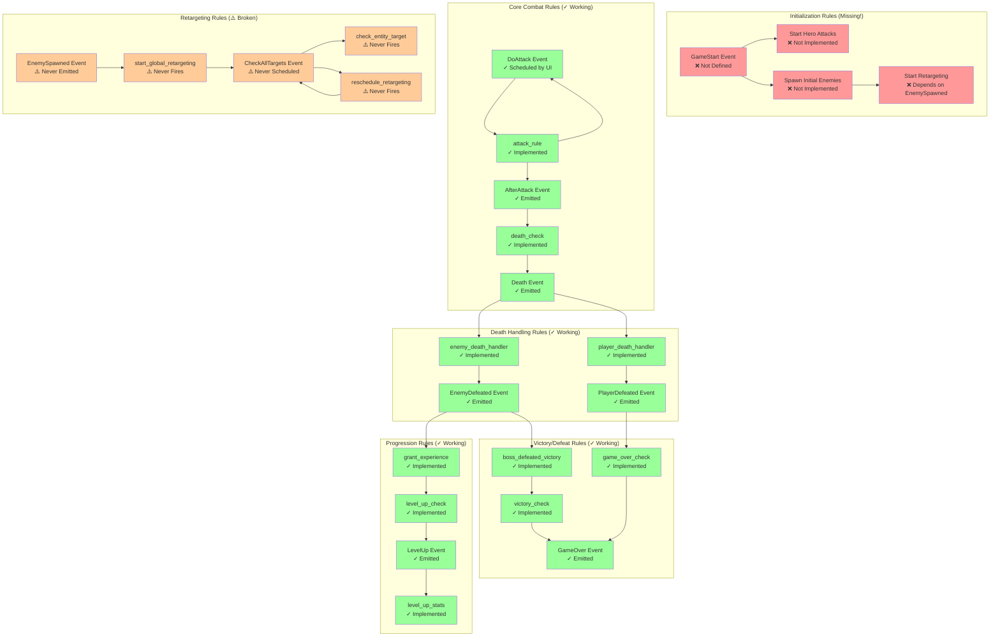
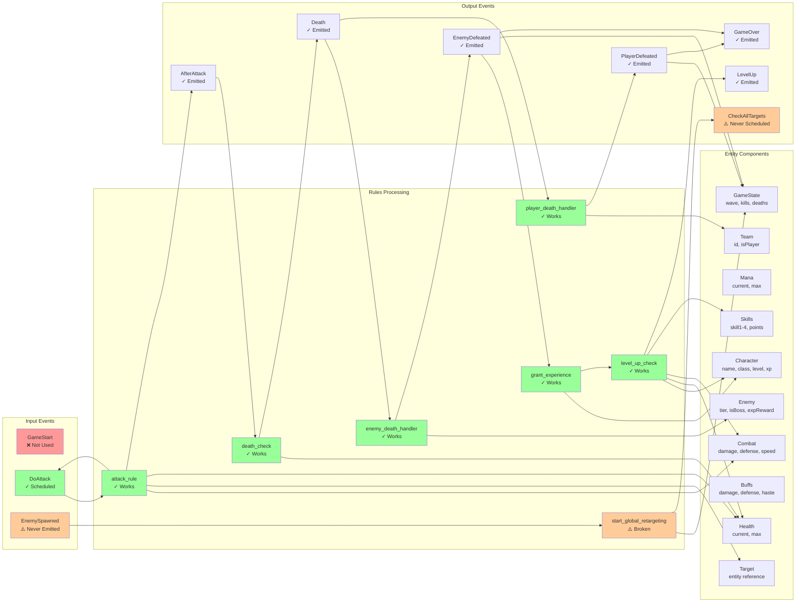
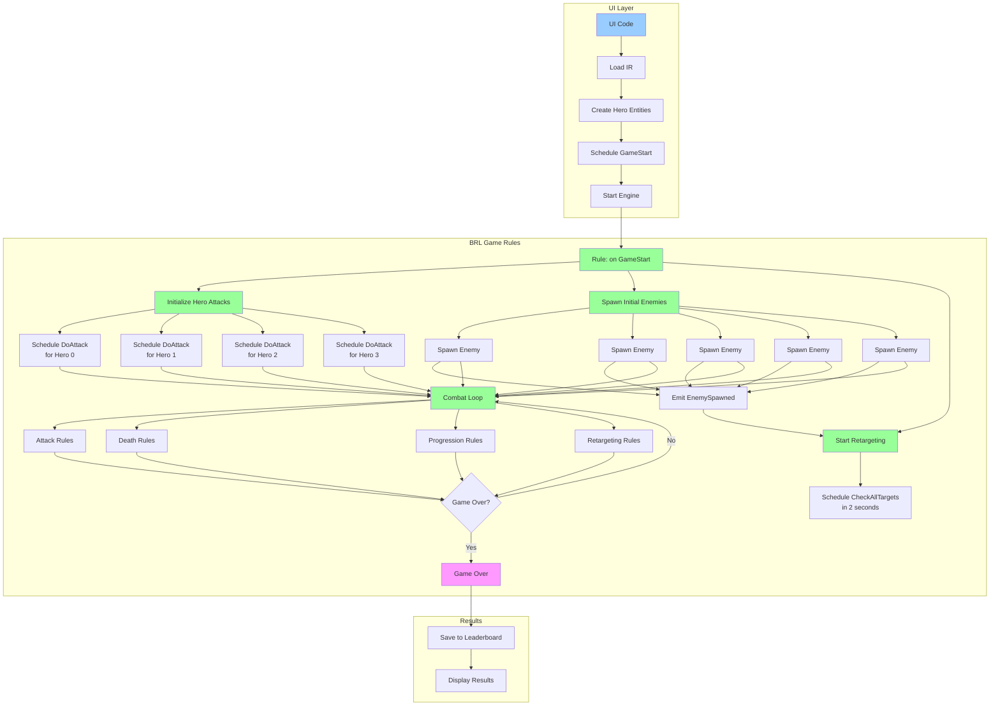

# Game Flow Diagrams - Classic RPG

This document contains detailed Mermaid diagrams visualizing the game flow.

## 1. Complete Game State Machine

## 2. Event Flow Diagram

## 3. Entity Lifecycle Diagram

```mermaid
flowchart TD
    subgraph "Hero Lifecycle"
        HeroCreate[Hero Created<br/>from Party Selection] --> HeroInit[Initialize Components:<br/>Character, Health, Mana<br/>Combat, Target, Team<br/>Skills, Buffs]
        HeroInit --> HeroIdle[Waiting for Combat]
        HeroIdle --> HeroAttack[Receives DoAttack Event]
        
        HeroAttack --> HeroLoop{While Alive &<br/>Has Target}
        HeroLoop -->|Attack| HeroDamage[Deal Damage]
        HeroDamage --> HeroSchedule[Schedule Next Attack]
        HeroSchedule --> HeroLoop
        
        HeroLoop -->|Damaged| HeroCheck{HP > 0?}
        HeroCheck -->|Yes| HeroLoop
        HeroCheck -->|No| HeroDeath[Hero Death]
        
        HeroDeath --> HeroPenalty[Apply 50s Penalty]
        HeroPenalty --> HeroRetarget[Retarget Enemies]
        HeroRetarget --> HeroRemain{Other Heroes<br/>Alive?}
        
        HeroRemain -->|Yes| HeroWait[Wait for Revival<br/>or Game End]
        HeroRemain -->|No| HeroGameOver[Trigger Game Over]
        
        HeroLoop -->|Gains XP| HeroXP{XP >= Threshold?}
        HeroXP -->|Yes| HeroLevelUp[Level Up]
        HeroLevelUp --> HeroStatsUp[Increase Stats]
        HeroStatsUp --> HeroSkillPt[Gain Skill Point]
        HeroSkillPt --> HeroLoop
        HeroXP -->|No| HeroLoop
    end
    
    subgraph "Enemy Lifecycle"
        EnemySpawn[Enemy Spawned<br/>by UI or Rule] --> EnemyInit[Initialize Components:<br/>Character, Health, Combat<br/>Target, Team, Enemy]
        EnemyInit --> EnemyTarget[Assign Random<br/>Hero Target]
        EnemyTarget --> EnemyAttack[Receive DoAttack Event]
        
        EnemyAttack --> EnemyLoop{While Alive &<br/>Has Target}
        EnemyLoop -->|Attack| EnemyDamage[Deal Damage]
        EnemyDamage --> EnemySchedule[Schedule Next Attack]
        EnemySchedule --> EnemyLoop
        
        EnemyLoop -->|Damaged| EnemyCheck{HP > 0?}
        EnemyCheck -->|Yes| EnemyLoop
        EnemyCheck -->|No| EnemyDeath[Enemy Death]
        
        EnemyDeath --> EnemyXP[Grant XP to Heroes]
        EnemyXP --> EnemyCount[Increment Kill Count]
        EnemyCount --> EnemyRemove[Remove Entity]
        EnemyRemove --> EnemySpawnNew{Spawn<br/>Replacement?}
        
        EnemySpawnNew -->|Yes| EnemySpawn
        EnemySpawnNew -->|No| EnemyVictory{Check Victory}
        
        EnemyVictory -->|5+ Kills| Victory[Victory!]
        EnemyVictory -->|Continue| EnemyEnd[Continue Game]
    end
    
    subgraph "GameState Lifecycle"
        GSCreate[GameState Created] --> GSInit[Initialize:<br/>currentWave=1<br/>enemiesDefeated=0<br/>retargetingActive=false]
        GSInit --> GSWait[Waiting for Events]
        
        GSWait --> GSEnemy[Enemy Defeated Event]
        GSEnemy --> GSIncKills[enemiesDefeated++]
        GSIncKills --> GSCheckV{enemiesDefeated >= 5?}
        GSCheckV -->|Yes| GSVictory[Set victory=true<br/>gameOver=true]
        GSCheckV -->|No| GSWait
        
        GSWait --> GSPlayer[Player Defeated Event]
        GSPlayer --> GSIncDeaths[playerDeaths++]
        GSIncDeaths --> GSCheckD{All Players Dead?}
        GSCheckD -->|Yes| GSDefeat[Set gameOver=true]
        GSCheckD -->|No| GSWait
        
        GSWait --> GSRetarget[CheckAllTargets Event]
        GSRetarget --> GSReschedule[Reschedule in 2s]
        GSReschedule --> GSWait
        
        GSVictory --> GSEnd[Game Over]
        GSDefeat --> GSEnd
    end
    
    style HeroCreate fill:#9cf
    style HeroGameOver fill:#f99
    style EnemySpawn fill:#fc9
    style Victory fill:#9f9
    style GSCreate fill:#c9f
    style GSVictory fill:#9f9
    style GSDefeat fill:#f99
```

## 4. Rule Dependency Graph

## 5. Data Flow Through Components

## 6. Proposed Fixed Architecture

## Legend

- 🟢 **Green (✓)**: Currently working correctly
- 🟡 **Yellow (⚠️)**: Broken or partially working
- 🔴 **Red (❌)**: Not implemented or critical issue
