# Game Flow Diagrams - Classic RPG

This document contains detailed Mermaid diagrams visualizing the game flow.

## 1. Complete Game State Machine

## 2. Event Flow Diagram

## 3. Entity Lifecycle Diagram

## 4. Rule Dependency Graph

```mermaid
graph TD
    subgraph "Initialization Rules (Missing!)"
        GameStart[GameStart Event<br/>❌ Not Defined]
        InitAttacks[Start Hero Attacks<br/>❌ Not Implemented]
        InitSpawn[Spawn Initial Enemies<br/>❌ Not Implemented]
        InitRetarget[Start Retargeting<br/>❌ Depends on EnemySpawned]
        
        GameStart --> InitAttacks
        GameStart --> InitSpawn
        InitSpawn --> InitRetarget
    end
    
    subgraph "Core Combat Rules (✓ Working)"
        DoAttack[DoAttack Event<br/>✓ Scheduled by UI]
        AttackRule[attack_rule<br/>✓ Implemented]
        AfterAttack[AfterAttack Event<br/>✓ Emitted]
        DeathCheck[death_check<br/>✓ Implemented]
        Death[Death Event<br/>✓ Emitted]
        
        DoAttack --> AttackRule
        AttackRule --> AfterAttack
        AfterAttack --> DeathCheck
        DeathCheck --> Death
        AttackRule --> DoAttack
    end
    
    subgraph "Death Handling Rules (✓ Working)"
        EnemyDeathHandler[enemy_death_handler<br/>✓ Implemented]
        PlayerDeathHandler[player_death_handler<br/>✓ Implemented]
        EnemyDefeated[EnemyDefeated Event<br/>✓ Emitted]
        PlayerDefeated[PlayerDefeated Event<br/>✓ Emitted]
        
        Death --> EnemyDeathHandler
        Death --> PlayerDeathHandler
        EnemyDeathHandler --> EnemyDefeated
        PlayerDeathHandler --> PlayerDefeated
    end
    
    subgraph "Progression Rules (✓ Working)"
        GrantXP[grant_experience<br/>✓ Implemented]
        CheckLevelUp[level_up_check<br/>✓ Implemented]
        LevelUp[LevelUp Event<br/>✓ Emitted]
        LevelUpStats[level_up_stats<br/>✓ Implemented]
        
        EnemyDefeated --> GrantXP
        GrantXP --> CheckLevelUp
        CheckLevelUp --> LevelUp
        LevelUp --> LevelUpStats
    end
    
    subgraph "Victory/Defeat Rules (✓ Working)"
        BossVictory[boss_defeated_victory<br/>✓ Implemented]
        VictoryCheck[victory_check<br/>✓ Implemented]
        GameOverCheck[game_over_check<br/>✓ Implemented]
        GameOver[GameOver Event<br/>✓ Emitted]
        
        EnemyDefeated --> BossVictory
        BossVictory --> VictoryCheck
        PlayerDefeated --> GameOverCheck
        VictoryCheck --> GameOver
        GameOverCheck --> GameOver
    end
    
    subgraph "Retargeting Rules (⚠️ Broken)"
        EnemySpawned[EnemySpawned Event<br/>⚠️ Never Emitted]
        StartRetargeting[start_global_retargeting<br/>⚠️ Never Fires]
        CheckAllTargets[CheckAllTargets Event<br/>⚠️ Never Scheduled]
        CheckEntityTarget[check_entity_target<br/>⚠️ Never Fires]
        RescheduleRetarget[reschedule_retargeting<br/>⚠️ Never Fires]
        
        EnemySpawned --> StartRetargeting
        StartRetargeting --> CheckAllTargets
        CheckAllTargets --> CheckEntityTarget
        CheckAllTargets --> RescheduleRetarget
        RescheduleRetarget --> CheckAllTargets
    end
    
    style GameStart fill:#f99
    style InitAttacks fill:#f99
    style InitSpawn fill:#f99
    style InitRetarget fill:#f99
    
    style DoAttack fill:#9f9
    style AttackRule fill:#9f9
    style AfterAttack fill:#9f9
    style DeathCheck fill:#9f9
    style Death fill:#9f9
    
    style EnemyDeathHandler fill:#9f9
    style PlayerDeathHandler fill:#9f9
    style EnemyDefeated fill:#9f9
    style PlayerDefeated fill:#9f9
    
    style GrantXP fill:#9f9
    style CheckLevelUp fill:#9f9
    style LevelUp fill:#9f9
    style LevelUpStats fill:#9f9
    
    style BossVictory fill:#9f9
    style VictoryCheck fill:#9f9
    style GameOverCheck fill:#9f9
    style GameOver fill:#9f9
    
    style EnemySpawned fill:#fc9
    style StartRetargeting fill:#fc9
    style CheckAllTargets fill:#fc9
    style CheckEntityTarget fill:#fc9
    style RescheduleRetarget fill:#fc9
```

## 5. Data Flow Through Components

## 6. Proposed Fixed Architecture

## Legend

- 🟢 **Green (✓)**: Currently working correctly
- 🟡 **Yellow (⚠️)**: Broken or partially working
- 🔴 **Red (❌)**: Not implemented or critical issue
